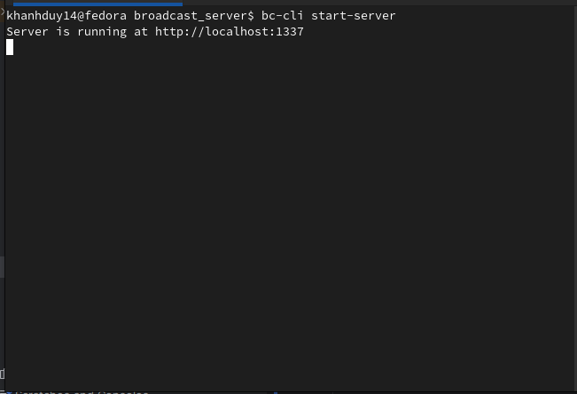
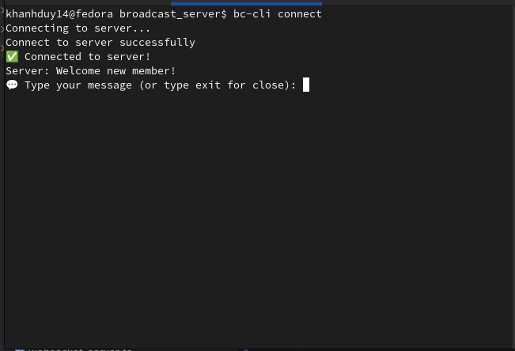
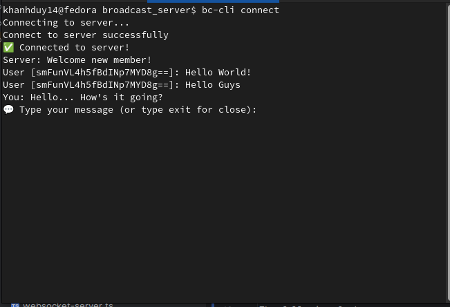
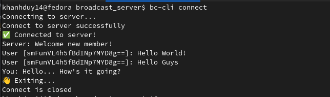
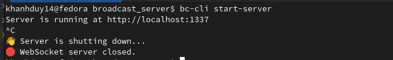

# Broadcast CLI

A custom WebSocket implementation for real-time communication between multiple clients and a server, built entirely from scratch without relying on third-party WebSocket libraries.

## Table of Contents
- [Overview](#overview)
- [Prerequisites](#prerequisites)
- [Installation](#installation)
- [Usage](#usage)
- [🚀 Coming Soon](#-coming-soon)
- [Technical Implementation](#technical-implementation)
- [Contributing](#contributing)
- [Uninstallation](#uninstallation)
- [License](#license)
- [Project Source](#project-source)

## Overview

Broadcast CLI is a command-line interface application that demonstrates WebSocket communication with these key features:

✅ **Custom WebSocket**  
🔒 **Two-Way Message Masking**  
🖥️ **Client-Server Broadcast**

## Prerequisites

- Node.js (version 14 or higher)
- npm (version 6 or higher)

## Installation

**Clone the Repository**
```bash
git clone git@github.com:khanhduy14/broadcast-cli.git
# Navigate to the project directory
cd broadcast-cli
```

**Install Dependencies**
```bash
npm install
```

**Link the Project Globally**
```bash
npm link
```

## Usage

| Feature | Command | Screenshot                                   |
|---------|---------|----------------------------------------------|
| Start the server | `npm run cli start-server` |      |
| Connect a client | `npm run cli connect` |  |
| Send messages | Type your message and press Enter |     |
| Exit a client | Type `exit` |       |
| Stop the server | Press `Ctrl + C` |       |

## 🚀 Coming Soon

The following features are on our roadmap for future releases:

### 🏓 Ping-Pong Mechanism
- Implementation of WebSocket ping/pong frames for connection health monitoring
- Automatic detection of disconnected clients
- Configurable timeout settings

### 📦 Fragmented Message Handling
- Support for sending large data payloads by splitting into multiple fragments
- Automatic reassembly of fragmented messages
- Progress indicators for large data transfers

## Technical Implementation

This project implements WebSocket protocol from scratch, including:

- Custom handshake process following RFC 6455
- Frame masking and unmasking
- Message encoding and decoding
- Socket management for multiple concurrent connections

## Contributing

1. Fork this repository
2. Create a new branch: `git checkout -b <branch_name>`
3. Make your changes and commit them: `git commit -am '<commit message>'`
4. Push your changes to your fork: `git push origin <branch_name>`
5. Create a pull request

## Uninstallation

If you want to remove the global link for the CLI:
```bash
npm unlink -g
```

## License

This project is licensed under the [MIT License](https://opensource.org/licenses/MIT).

## Project Source

This project was inspired by the [Broadcast Server](https://roadmap.sh/projects/broadcast-server) challenge from [Roadmap.sh](https://www.roadmap.sh).
